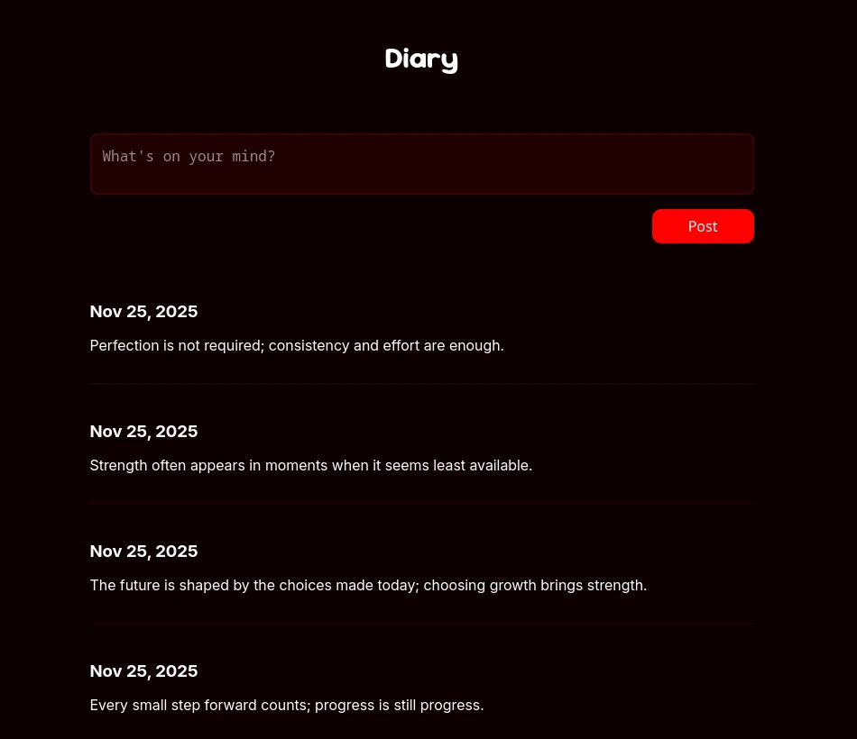

A simple ASP.NET application with a React frontend and an SQLite database for saving diary entries, created for learning purposes.

Currently, it has only two endpoints: POST /posts (for adding entries) and GET /posts (for getting all entries).

